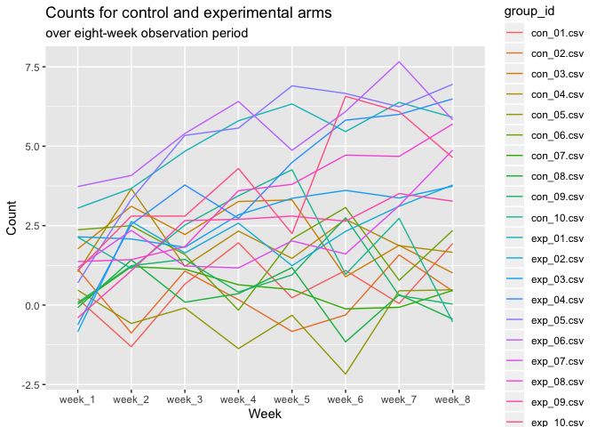
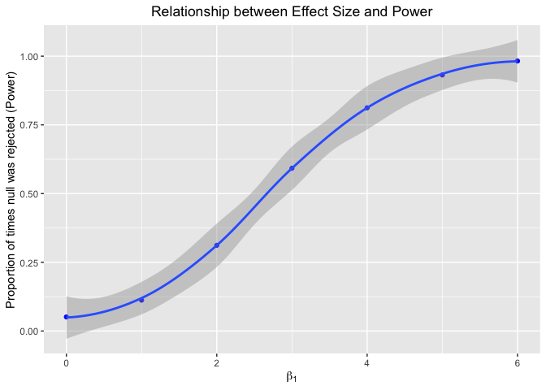
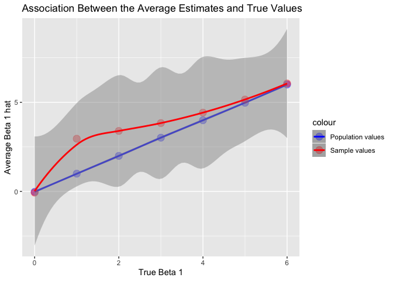

Hw5
================
Yingxi Ji
11/5/2019

# Problem 1

``` r
set.seed(10)

iris_with_missing = iris %>% 
  map_df(~replace(.x, sample(1:150, 20), NA)) %>%
  mutate(Species = as.character(Species))

# Write a function to fill the NA. 
fill_na = function(x) {
  if (is.numeric(x)) { 
    replace_na(x, mean(x, na.rm = TRUE))
    }
  else if (is.character(x)) { 
     replace_na(x, "virginica")
  }
}

# Apply the function to the dataset 
irs_filled_df = (map_dfr(iris_with_missing, fill_na, .id = "input")) 

irs_filled_df%>%
  knitr::kable(align = 'c', digits = 2)
```

| input | Sepal.Length | Sepal.Width | Petal.Length | Petal.Width |  Species   |
| :---: | :----------: | :---------: | :----------: | :---------: | :--------: |
|   1   |     5.10     |    3.50     |     1.40     |    0.20     |   setosa   |
|   1   |     4.90     |    3.00     |     1.40     |    0.20     |   setosa   |
|   1   |     4.70     |    3.20     |     1.30     |    0.20     |   setosa   |
|   1   |     4.60     |    3.10     |     1.50     |    1.19     |   setosa   |
|   1   |     5.00     |    3.60     |     1.40     |    0.20     |   setosa   |
|   1   |     5.40     |    3.90     |     1.70     |    0.40     |   setosa   |
|   1   |     5.82     |    3.40     |     1.40     |    0.30     |   setosa   |
|   1   |     5.00     |    3.40     |     1.50     |    0.20     |   setosa   |
|   1   |     4.40     |    2.90     |     1.40     |    0.20     |   setosa   |
|   1   |     4.90     |    3.10     |     3.77     |    0.10     |   setosa   |
|   1   |     5.40     |    3.08     |     1.50     |    0.20     |   setosa   |
|   1   |     4.80     |    3.40     |     1.60     |    0.20     |   setosa   |
|   1   |     5.82     |    3.08     |     1.40     |    0.10     |   setosa   |
|   1   |     4.30     |    3.00     |     3.77     |    0.10     |   setosa   |
|   1   |     5.82     |    4.00     |     3.77     |    0.20     |   setosa   |
|   1   |     5.70     |    4.40     |     1.50     |    0.40     |   setosa   |
|   1   |     5.40     |    3.90     |     1.30     |    0.40     |   setosa   |
|   1   |     5.10     |    3.50     |     1.40     |    1.19     |   setosa   |
|   1   |     5.70     |    3.80     |     1.70     |    0.30     |   setosa   |
|   1   |     5.10     |    3.80     |     1.50     |    1.19     |   setosa   |
|   1   |     5.40     |    3.40     |     1.70     |    0.20     |   setosa   |
|   1   |     5.10     |    3.70     |     1.50     |    0.40     | virginica  |
|   1   |     4.60     |    3.60     |     1.00     |    0.20     |   setosa   |
|   1   |     5.82     |    3.30     |     3.77     |    0.50     |   setosa   |
|   1   |     4.80     |    3.40     |     1.90     |    0.20     | virginica  |
|   1   |     5.00     |    3.00     |     3.77     |    0.20     |   setosa   |
|   1   |     5.00     |    3.40     |     1.60     |    0.40     | virginica  |
|   1   |     5.20     |    3.50     |     1.50     |    0.20     |   setosa   |
|   1   |     5.82     |    3.40     |     1.40     |    0.20     |   setosa   |
|   1   |     4.70     |    3.20     |     1.60     |    0.20     |   setosa   |
|   1   |     4.80     |    3.10     |     3.77     |    0.20     |   setosa   |
|   1   |     5.40     |    3.08     |     1.50     |    0.40     |   setosa   |
|   1   |     5.20     |    3.08     |     1.50     |    0.10     |   setosa   |
|   1   |     5.50     |    4.20     |     1.40     |    0.20     |   setosa   |
|   1   |     4.90     |    3.10     |     3.77     |    0.20     |   setosa   |
|   1   |     5.00     |    3.20     |     1.20     |    0.20     |   setosa   |
|   1   |     5.50     |    3.50     |     1.30     |    0.20     |   setosa   |
|   1   |     4.90     |    3.60     |     1.40     |    0.10     |   setosa   |
|   1   |     4.40     |    3.00     |     1.30     |    1.19     |   setosa   |
|   1   |     5.10     |    3.40     |     1.50     |    0.20     |   setosa   |
|   1   |     5.00     |    3.50     |     1.30     |    0.30     |   setosa   |
|   1   |     4.50     |    3.08     |     1.30     |    1.19     | virginica  |
|   1   |     4.40     |    3.20     |     1.30     |    0.20     |   setosa   |
|   1   |     5.00     |    3.50     |     1.60     |    0.60     |   setosa   |
|   1   |     5.10     |    3.80     |     1.90     |    0.40     |   setosa   |
|   1   |     4.80     |    3.00     |     1.40     |    0.30     | virginica  |
|   1   |     5.10     |    3.80     |     1.60     |    0.20     |   setosa   |
|   1   |     4.60     |    3.20     |     3.77     |    0.20     |   setosa   |
|   1   |     5.30     |    3.70     |     1.50     |    0.20     |   setosa   |
|   1   |     5.00     |    3.08     |     1.40     |    0.20     |   setosa   |
|   1   |     7.00     |    3.08     |     4.70     |    1.40     | virginica  |
|   1   |     6.40     |    3.20     |     4.50     |    1.50     | versicolor |
|   1   |     6.90     |    3.10     |     4.90     |    1.50     | versicolor |
|   1   |     5.50     |    2.30     |     4.00     |    1.30     | versicolor |
|   1   |     6.50     |    2.80     |     4.60     |    1.50     | versicolor |
|   1   |     5.70     |    2.80     |     4.50     |    1.30     | versicolor |
|   1   |     6.30     |    3.30     |     4.70     |    1.60     | virginica  |
|   1   |     4.90     |    2.40     |     3.77     |    1.00     | versicolor |
|   1   |     6.60     |    2.90     |     4.60     |    1.30     | virginica  |
|   1   |     5.20     |    2.70     |     3.90     |    1.40     | versicolor |
|   1   |     5.00     |    2.00     |     3.77     |    1.00     | versicolor |
|   1   |     5.90     |    3.00     |     4.20     |    1.50     | versicolor |
|   1   |     6.00     |    2.20     |     4.00     |    1.19     | versicolor |
|   1   |     6.10     |    2.90     |     4.70     |    1.40     | versicolor |
|   1   |     5.60     |    2.90     |     3.60     |    1.30     | versicolor |
|   1   |     6.70     |    3.10     |     4.40     |    1.40     | versicolor |
|   1   |     5.60     |    3.00     |     4.50     |    1.50     | versicolor |
|   1   |     5.80     |    3.08     |     4.10     |    1.00     | versicolor |
|   1   |     6.20     |    2.20     |     4.50     |    1.50     | versicolor |
|   1   |     5.60     |    2.50     |     3.90     |    1.10     | versicolor |
|   1   |     5.90     |    3.20     |     4.80     |    1.80     | versicolor |
|   1   |     5.82     |    2.80     |     4.00     |    1.30     | virginica  |
|   1   |     6.30     |    2.50     |     4.90     |    1.50     | versicolor |
|   1   |     5.82     |    2.80     |     3.77     |    1.20     | versicolor |
|   1   |     6.40     |    2.90     |     4.30     |    1.30     | versicolor |
|   1   |     6.60     |    3.00     |     4.40     |    1.40     | versicolor |
|   1   |     6.80     |    2.80     |     4.80     |    1.40     | versicolor |
|   1   |     6.70     |    3.08     |     5.00     |    1.19     | versicolor |
|   1   |     6.00     |    3.08     |     4.50     |    1.19     | versicolor |
|   1   |     5.70     |    2.60     |     3.50     |    1.00     | virginica  |
|   1   |     5.50     |    2.40     |     3.80     |    1.10     | versicolor |
|   1   |     5.82     |    2.40     |     3.70     |    1.00     | versicolor |
|   1   |     5.80     |    2.70     |     3.90     |    1.20     | versicolor |
|   1   |     6.00     |    2.70     |     5.10     |    1.60     | versicolor |
|   1   |     5.40     |    3.00     |     4.50     |    1.50     | versicolor |
|   1   |     5.82     |    3.40     |     4.50     |    1.60     | versicolor |
|   1   |     6.70     |    3.10     |     4.70     |    1.19     | versicolor |
|   1   |     5.82     |    3.08     |     4.40     |    1.30     | versicolor |
|   1   |     5.60     |    3.00     |     3.77     |    1.19     | versicolor |
|   1   |     5.50     |    2.50     |     4.00     |    1.19     | versicolor |
|   1   |     5.50     |    3.08     |     4.40     |    1.20     | versicolor |
|   1   |     5.82     |    3.08     |     4.60     |    1.19     | versicolor |
|   1   |     5.80     |    3.08     |     4.00     |    1.19     | versicolor |
|   1   |     5.00     |    2.30     |     3.30     |    1.19     | virginica  |
|   1   |     5.82     |    2.70     |     4.20     |    1.30     | versicolor |
|   1   |     5.70     |    3.00     |     4.20     |    1.20     | versicolor |
|   1   |     5.70     |    2.90     |     4.20     |    1.30     | versicolor |
|   1   |     6.20     |    2.90     |     4.30     |    1.30     | versicolor |
|   1   |     5.10     |    2.50     |     3.00     |    1.19     | versicolor |
|   1   |     5.70     |    2.80     |     4.10     |    1.30     | virginica  |
|   1   |     6.30     |    3.08     |     3.77     |    2.50     | virginica  |
|   1   |     5.80     |    2.70     |     5.10     |    1.90     | virginica  |
|   1   |     7.10     |    3.00     |     5.90     |    2.10     | virginica  |
|   1   |     6.30     |    2.90     |     5.60     |    1.80     | virginica  |
|   1   |     6.50     |    3.08     |     5.80     |    2.20     | virginica  |
|   1   |     7.60     |    3.00     |     6.60     |    2.10     | virginica  |
|   1   |     4.90     |    2.50     |     4.50     |    1.70     | virginica  |
|   1   |     7.30     |    2.90     |     6.30     |    1.80     | virginica  |
|   1   |     6.70     |    3.08     |     3.77     |    1.80     | virginica  |
|   1   |     5.82     |    3.60     |     3.77     |    2.50     | virginica  |
|   1   |     6.50     |    3.20     |     5.10     |    2.00     | virginica  |
|   1   |     5.82     |    2.70     |     5.30     |    1.90     | virginica  |
|   1   |     6.80     |    3.00     |     5.50     |    2.10     | virginica  |
|   1   |     5.70     |    3.08     |     5.00     |    2.00     | virginica  |
|   1   |     5.80     |    2.80     |     5.10     |    2.40     | virginica  |
|   1   |     6.40     |    3.20     |     5.30     |    2.30     | virginica  |
|   1   |     6.50     |    3.00     |     3.77     |    1.80     | virginica  |
|   1   |     7.70     |    3.80     |     6.70     |    1.19     | virginica  |
|   1   |     7.70     |    2.60     |     6.90     |    2.30     | virginica  |
|   1   |     6.00     |    2.20     |     5.00     |    1.50     | virginica  |
|   1   |     5.82     |    3.20     |     5.70     |    1.19     | virginica  |
|   1   |     5.60     |    3.08     |     4.90     |    2.00     | virginica  |
|   1   |     7.70     |    2.80     |     6.70     |    2.00     | virginica  |
|   1   |     6.30     |    2.70     |     4.90     |    1.80     | virginica  |
|   1   |     6.70     |    3.30     |     5.70     |    2.10     | virginica  |
|   1   |     7.20     |    3.20     |     6.00     |    1.80     | virginica  |
|   1   |     6.20     |    2.80     |     4.80     |    1.80     | virginica  |
|   1   |     6.10     |    3.00     |     4.90     |    1.80     | virginica  |
|   1   |     6.40     |    2.80     |     5.60     |    2.10     | virginica  |
|   1   |     7.20     |    3.00     |     5.80     |    1.60     | virginica  |
|   1   |     7.40     |    2.80     |     6.10     |    1.19     | virginica  |
|   1   |     7.90     |    3.80     |     3.77     |    2.00     | virginica  |
|   1   |     6.40     |    2.80     |     3.77     |    2.20     | virginica  |
|   1   |     5.82     |    2.80     |     5.10     |    1.50     | virginica  |
|   1   |     6.10     |    3.08     |     5.60     |    1.40     | virginica  |
|   1   |     5.82     |    3.00     |     6.10     |    2.30     | virginica  |
|   1   |     5.82     |    3.40     |     5.60     |    1.19     | virginica  |
|   1   |     6.40     |    3.10     |     5.50     |    1.19     | virginica  |
|   1   |     6.00     |    3.00     |     4.80     |    1.80     | virginica  |
|   1   |     6.90     |    3.10     |     5.40     |    2.10     | virginica  |
|   1   |     6.70     |    3.10     |     5.60     |    2.40     | virginica  |
|   1   |     6.90     |    3.10     |     5.10     |    2.30     | virginica  |
|   1   |     5.82     |    2.70     |     5.10     |    1.90     | virginica  |
|   1   |     6.80     |    3.20     |     3.77     |    2.30     | virginica  |
|   1   |     6.70     |    3.30     |     3.77     |    2.50     | virginica  |
|   1   |     6.70     |    3.00     |     5.20     |    2.30     | virginica  |
|   1   |     6.30     |    2.50     |     5.00     |    1.90     | virginica  |
|   1   |     6.50     |    3.00     |     5.20     |    2.00     | virginica  |
|   1   |     5.82     |    3.40     |     5.40     |    2.30     | virginica  |
|   1   |     5.90     |    3.00     |     5.10     |    1.80     | virginica  |

The iris\_with\_missing dataset contains 150 observations and 5
variables. This is a (150, 5) dataframe, with 100 NA.

# Problem 2

``` r
# Load the data in 
files = list.files(path = "data")

# Map the data with groups(controls and experiments)
agg_data = tibble(files) %>% 
  mutate(
    file_content = map(files, ~ read_csv(file.path("./data", .)))
  ) %>% 
  unnest()
```

    ## Parsed with column specification:
    ## cols(
    ##   week_1 = col_double(),
    ##   week_2 = col_double(),
    ##   week_3 = col_double(),
    ##   week_4 = col_double(),
    ##   week_5 = col_double(),
    ##   week_6 = col_double(),
    ##   week_7 = col_double(),
    ##   week_8 = col_double()
    ## )
    ## Parsed with column specification:
    ## cols(
    ##   week_1 = col_double(),
    ##   week_2 = col_double(),
    ##   week_3 = col_double(),
    ##   week_4 = col_double(),
    ##   week_5 = col_double(),
    ##   week_6 = col_double(),
    ##   week_7 = col_double(),
    ##   week_8 = col_double()
    ## )
    ## Parsed with column specification:
    ## cols(
    ##   week_1 = col_double(),
    ##   week_2 = col_double(),
    ##   week_3 = col_double(),
    ##   week_4 = col_double(),
    ##   week_5 = col_double(),
    ##   week_6 = col_double(),
    ##   week_7 = col_double(),
    ##   week_8 = col_double()
    ## )
    ## Parsed with column specification:
    ## cols(
    ##   week_1 = col_double(),
    ##   week_2 = col_double(),
    ##   week_3 = col_double(),
    ##   week_4 = col_double(),
    ##   week_5 = col_double(),
    ##   week_6 = col_double(),
    ##   week_7 = col_double(),
    ##   week_8 = col_double()
    ## )
    ## Parsed with column specification:
    ## cols(
    ##   week_1 = col_double(),
    ##   week_2 = col_double(),
    ##   week_3 = col_double(),
    ##   week_4 = col_double(),
    ##   week_5 = col_double(),
    ##   week_6 = col_double(),
    ##   week_7 = col_double(),
    ##   week_8 = col_double()
    ## )
    ## Parsed with column specification:
    ## cols(
    ##   week_1 = col_double(),
    ##   week_2 = col_double(),
    ##   week_3 = col_double(),
    ##   week_4 = col_double(),
    ##   week_5 = col_double(),
    ##   week_6 = col_double(),
    ##   week_7 = col_double(),
    ##   week_8 = col_double()
    ## )
    ## Parsed with column specification:
    ## cols(
    ##   week_1 = col_double(),
    ##   week_2 = col_double(),
    ##   week_3 = col_double(),
    ##   week_4 = col_double(),
    ##   week_5 = col_double(),
    ##   week_6 = col_double(),
    ##   week_7 = col_double(),
    ##   week_8 = col_double()
    ## )
    ## Parsed with column specification:
    ## cols(
    ##   week_1 = col_double(),
    ##   week_2 = col_double(),
    ##   week_3 = col_double(),
    ##   week_4 = col_double(),
    ##   week_5 = col_double(),
    ##   week_6 = col_double(),
    ##   week_7 = col_double(),
    ##   week_8 = col_double()
    ## )
    ## Parsed with column specification:
    ## cols(
    ##   week_1 = col_double(),
    ##   week_2 = col_double(),
    ##   week_3 = col_double(),
    ##   week_4 = col_double(),
    ##   week_5 = col_double(),
    ##   week_6 = col_double(),
    ##   week_7 = col_double(),
    ##   week_8 = col_double()
    ## )
    ## Parsed with column specification:
    ## cols(
    ##   week_1 = col_double(),
    ##   week_2 = col_double(),
    ##   week_3 = col_double(),
    ##   week_4 = col_double(),
    ##   week_5 = col_double(),
    ##   week_6 = col_double(),
    ##   week_7 = col_double(),
    ##   week_8 = col_double()
    ## )
    ## Parsed with column specification:
    ## cols(
    ##   week_1 = col_double(),
    ##   week_2 = col_double(),
    ##   week_3 = col_double(),
    ##   week_4 = col_double(),
    ##   week_5 = col_double(),
    ##   week_6 = col_double(),
    ##   week_7 = col_double(),
    ##   week_8 = col_double()
    ## )
    ## Parsed with column specification:
    ## cols(
    ##   week_1 = col_double(),
    ##   week_2 = col_double(),
    ##   week_3 = col_double(),
    ##   week_4 = col_double(),
    ##   week_5 = col_double(),
    ##   week_6 = col_double(),
    ##   week_7 = col_double(),
    ##   week_8 = col_double()
    ## )
    ## Parsed with column specification:
    ## cols(
    ##   week_1 = col_double(),
    ##   week_2 = col_double(),
    ##   week_3 = col_double(),
    ##   week_4 = col_double(),
    ##   week_5 = col_double(),
    ##   week_6 = col_double(),
    ##   week_7 = col_double(),
    ##   week_8 = col_double()
    ## )
    ## Parsed with column specification:
    ## cols(
    ##   week_1 = col_double(),
    ##   week_2 = col_double(),
    ##   week_3 = col_double(),
    ##   week_4 = col_double(),
    ##   week_5 = col_double(),
    ##   week_6 = col_double(),
    ##   week_7 = col_double(),
    ##   week_8 = col_double()
    ## )
    ## Parsed with column specification:
    ## cols(
    ##   week_1 = col_double(),
    ##   week_2 = col_double(),
    ##   week_3 = col_double(),
    ##   week_4 = col_double(),
    ##   week_5 = col_double(),
    ##   week_6 = col_double(),
    ##   week_7 = col_double(),
    ##   week_8 = col_double()
    ## )
    ## Parsed with column specification:
    ## cols(
    ##   week_1 = col_double(),
    ##   week_2 = col_double(),
    ##   week_3 = col_double(),
    ##   week_4 = col_double(),
    ##   week_5 = col_double(),
    ##   week_6 = col_double(),
    ##   week_7 = col_double(),
    ##   week_8 = col_double()
    ## )
    ## Parsed with column specification:
    ## cols(
    ##   week_1 = col_double(),
    ##   week_2 = col_double(),
    ##   week_3 = col_double(),
    ##   week_4 = col_double(),
    ##   week_5 = col_double(),
    ##   week_6 = col_double(),
    ##   week_7 = col_double(),
    ##   week_8 = col_double()
    ## )
    ## Parsed with column specification:
    ## cols(
    ##   week_1 = col_double(),
    ##   week_2 = col_double(),
    ##   week_3 = col_double(),
    ##   week_4 = col_double(),
    ##   week_5 = col_double(),
    ##   week_6 = col_double(),
    ##   week_7 = col_double(),
    ##   week_8 = col_double()
    ## )
    ## Parsed with column specification:
    ## cols(
    ##   week_1 = col_double(),
    ##   week_2 = col_double(),
    ##   week_3 = col_double(),
    ##   week_4 = col_double(),
    ##   week_5 = col_double(),
    ##   week_6 = col_double(),
    ##   week_7 = col_double(),
    ##   week_8 = col_double()
    ## )
    ## Parsed with column specification:
    ## cols(
    ##   week_1 = col_double(),
    ##   week_2 = col_double(),
    ##   week_3 = col_double(),
    ##   week_4 = col_double(),
    ##   week_5 = col_double(),
    ##   week_6 = col_double(),
    ##   week_7 = col_double(),
    ##   week_8 = col_double()
    ## )

    ## Warning: `cols` is now required.
    ## Please use `cols = c(file_content)`

``` r
# Tidy data 
tidy_data = 
  agg_data %>%
  rename(group_id = "files") %>% 
  pivot_longer(
    week_1:week_8, 
    names_to = "week", 
    values_to = "value"
  )
# Show the current data 
tidy_data %>% 
  knitr::kable()
```

| group\_id   | week    |  value |
| :---------- | :------ | -----: |
| con\_01.csv | week\_1 |   0.20 |
| con\_01.csv | week\_2 | \-1.31 |
| con\_01.csv | week\_3 |   0.66 |
| con\_01.csv | week\_4 |   1.96 |
| con\_01.csv | week\_5 |   0.23 |
| con\_01.csv | week\_6 |   1.09 |
| con\_01.csv | week\_7 |   0.05 |
| con\_01.csv | week\_8 |   1.94 |
| con\_02.csv | week\_1 |   1.13 |
| con\_02.csv | week\_2 | \-0.88 |
| con\_02.csv | week\_3 |   1.07 |
| con\_02.csv | week\_4 |   0.17 |
| con\_02.csv | week\_5 | \-0.83 |
| con\_02.csv | week\_6 | \-0.31 |
| con\_02.csv | week\_7 |   1.58 |
| con\_02.csv | week\_8 |   0.44 |
| con\_03.csv | week\_1 |   1.77 |
| con\_03.csv | week\_2 |   3.11 |
| con\_03.csv | week\_3 |   2.22 |
| con\_03.csv | week\_4 |   3.26 |
| con\_03.csv | week\_5 |   3.31 |
| con\_03.csv | week\_6 |   0.89 |
| con\_03.csv | week\_7 |   1.88 |
| con\_03.csv | week\_8 |   1.01 |
| con\_04.csv | week\_1 |   1.04 |
| con\_04.csv | week\_2 |   3.66 |
| con\_04.csv | week\_3 |   1.22 |
| con\_04.csv | week\_4 |   2.33 |
| con\_04.csv | week\_5 |   1.47 |
| con\_04.csv | week\_6 |   2.70 |
| con\_04.csv | week\_7 |   1.87 |
| con\_04.csv | week\_8 |   1.66 |
| con\_05.csv | week\_1 |   0.47 |
| con\_05.csv | week\_2 | \-0.58 |
| con\_05.csv | week\_3 | \-0.09 |
| con\_05.csv | week\_4 | \-1.37 |
| con\_05.csv | week\_5 | \-0.32 |
| con\_05.csv | week\_6 | \-2.17 |
| con\_05.csv | week\_7 |   0.45 |
| con\_05.csv | week\_8 |   0.48 |
| con\_06.csv | week\_1 |   2.37 |
| con\_06.csv | week\_2 |   2.50 |
| con\_06.csv | week\_3 |   1.59 |
| con\_06.csv | week\_4 | \-0.16 |
| con\_06.csv | week\_5 |   2.08 |
| con\_06.csv | week\_6 |   3.07 |
| con\_06.csv | week\_7 |   0.78 |
| con\_06.csv | week\_8 |   2.35 |
| con\_07.csv | week\_1 |   0.03 |
| con\_07.csv | week\_2 |   1.21 |
| con\_07.csv | week\_3 |   1.13 |
| con\_07.csv | week\_4 |   0.64 |
| con\_07.csv | week\_5 |   0.49 |
| con\_07.csv | week\_6 | \-0.12 |
| con\_07.csv | week\_7 | \-0.07 |
| con\_07.csv | week\_8 |   0.46 |
| con\_08.csv | week\_1 | \-0.08 |
| con\_08.csv | week\_2 |   1.42 |
| con\_08.csv | week\_3 |   0.09 |
| con\_08.csv | week\_4 |   0.36 |
| con\_08.csv | week\_5 |   1.18 |
| con\_08.csv | week\_6 | \-1.16 |
| con\_08.csv | week\_7 |   0.33 |
| con\_08.csv | week\_8 | \-0.44 |
| con\_09.csv | week\_1 |   0.08 |
| con\_09.csv | week\_2 |   1.24 |
| con\_09.csv | week\_3 |   1.44 |
| con\_09.csv | week\_4 |   0.41 |
| con\_09.csv | week\_5 |   0.95 |
| con\_09.csv | week\_6 |   2.75 |
| con\_09.csv | week\_7 |   0.30 |
| con\_09.csv | week\_8 |   0.03 |
| con\_10.csv | week\_1 |   2.14 |
| con\_10.csv | week\_2 |   1.15 |
| con\_10.csv | week\_3 |   2.52 |
| con\_10.csv | week\_4 |   3.44 |
| con\_10.csv | week\_5 |   4.26 |
| con\_10.csv | week\_6 |   0.97 |
| con\_10.csv | week\_7 |   2.73 |
| con\_10.csv | week\_8 | \-0.53 |
| exp\_01.csv | week\_1 |   3.05 |
| exp\_01.csv | week\_2 |   3.67 |
| exp\_01.csv | week\_3 |   4.84 |
| exp\_01.csv | week\_4 |   5.80 |
| exp\_01.csv | week\_5 |   6.33 |
| exp\_01.csv | week\_6 |   5.46 |
| exp\_01.csv | week\_7 |   6.38 |
| exp\_01.csv | week\_8 |   5.91 |
| exp\_02.csv | week\_1 | \-0.84 |
| exp\_02.csv | week\_2 |   2.63 |
| exp\_02.csv | week\_3 |   1.64 |
| exp\_02.csv | week\_4 |   2.58 |
| exp\_02.csv | week\_5 |   1.24 |
| exp\_02.csv | week\_6 |   2.32 |
| exp\_02.csv | week\_7 |   3.11 |
| exp\_02.csv | week\_8 |   3.78 |
| exp\_03.csv | week\_1 |   2.15 |
| exp\_03.csv | week\_2 |   2.08 |
| exp\_03.csv | week\_3 |   1.82 |
| exp\_03.csv | week\_4 |   2.84 |
| exp\_03.csv | week\_5 |   3.36 |
| exp\_03.csv | week\_6 |   3.61 |
| exp\_03.csv | week\_7 |   3.37 |
| exp\_03.csv | week\_8 |   3.74 |
| exp\_04.csv | week\_1 | \-0.62 |
| exp\_04.csv | week\_2 |   2.54 |
| exp\_04.csv | week\_3 |   3.78 |
| exp\_04.csv | week\_4 |   2.73 |
| exp\_04.csv | week\_5 |   4.49 |
| exp\_04.csv | week\_6 |   5.82 |
| exp\_04.csv | week\_7 |   6.00 |
| exp\_04.csv | week\_8 |   6.49 |
| exp\_05.csv | week\_1 |   0.70 |
| exp\_05.csv | week\_2 |   3.33 |
| exp\_05.csv | week\_3 |   5.34 |
| exp\_05.csv | week\_4 |   5.57 |
| exp\_05.csv | week\_5 |   6.90 |
| exp\_05.csv | week\_6 |   6.66 |
| exp\_05.csv | week\_7 |   6.24 |
| exp\_05.csv | week\_8 |   6.95 |
| exp\_06.csv | week\_1 |   3.73 |
| exp\_06.csv | week\_2 |   4.08 |
| exp\_06.csv | week\_3 |   5.40 |
| exp\_06.csv | week\_4 |   6.41 |
| exp\_06.csv | week\_5 |   4.87 |
| exp\_06.csv | week\_6 |   6.09 |
| exp\_06.csv | week\_7 |   7.66 |
| exp\_06.csv | week\_8 |   5.83 |
| exp\_07.csv | week\_1 |   1.18 |
| exp\_07.csv | week\_2 |   2.35 |
| exp\_07.csv | week\_3 |   1.23 |
| exp\_07.csv | week\_4 |   1.17 |
| exp\_07.csv | week\_5 |   2.02 |
| exp\_07.csv | week\_6 |   1.61 |
| exp\_07.csv | week\_7 |   3.13 |
| exp\_07.csv | week\_8 |   4.88 |
| exp\_08.csv | week\_1 |   1.37 |
| exp\_08.csv | week\_2 |   1.43 |
| exp\_08.csv | week\_3 |   1.84 |
| exp\_08.csv | week\_4 |   3.60 |
| exp\_08.csv | week\_5 |   3.80 |
| exp\_08.csv | week\_6 |   4.72 |
| exp\_08.csv | week\_7 |   4.68 |
| exp\_08.csv | week\_8 |   5.70 |
| exp\_09.csv | week\_1 | \-0.40 |
| exp\_09.csv | week\_2 |   1.08 |
| exp\_09.csv | week\_3 |   2.66 |
| exp\_09.csv | week\_4 |   2.70 |
| exp\_09.csv | week\_5 |   2.80 |
| exp\_09.csv | week\_6 |   2.64 |
| exp\_09.csv | week\_7 |   3.51 |
| exp\_09.csv | week\_8 |   3.27 |
| exp\_10.csv | week\_1 |   1.09 |
| exp\_10.csv | week\_2 |   2.80 |
| exp\_10.csv | week\_3 |   2.80 |
| exp\_10.csv | week\_4 |   4.30 |
| exp\_10.csv | week\_5 |   2.25 |
| exp\_10.csv | week\_6 |   6.57 |
| exp\_10.csv | week\_7 |   6.09 |
| exp\_10.csv | week\_8 |   4.64 |

``` r
# Make a plot of different groups 
tidy_data %>% 
  ggplot(aes(x = week, y = value)) +
  geom_line(aes(group = group_id, color = group_id)) +
  labs(
        title = "Counts for control and experimental arms",
        subtitle = "over eight-week observation period",
        x = "Week",
        y = "Count")
```

<!-- -->

We can see the pattern that the experiment group has higher values and
increase along with the time. On the other hand, the control group has a
reletively small variance and small change along the time.

# Problem 3

``` r
# Write a slr function 
sim_lin_regression = function(n=30, beta0=2, beta1 = 0) {
  
  sim_data = tibble(
    x = rnorm(n, mean = 0, sd = 1),
    y = beta0 + beta1 * x + rnorm(n, 0, sqrt(50))
  )
  
  ls_fit = lm(y ~ x, data = sim_data) %>% 
    broom::tidy()
  
  tibble(
    beta_1_hat = ls_fit[[2,2]],
    p_value = ls_fit[[2,5]]
  )
}

# do 10000 times simulations 
sim_results = 
  rerun(10000, sim_lin_regression(30, 2, 0)) %>% 
  bind_rows()

repeat_results = 
  tibble(beta1 = c(0, 1, 2, 3, 4, 5, 6)) %>% 
  mutate(
    output_list = map(.x = beta1, ~rerun(10000,       
                                    sim_lin_regression(beta1 = .x))),
    estimate_df = map(output_list, bind_rows)) %>% 
  select(-output_list) %>% 
  unnest(estimate_df)
```

## making plots

### plot about relationship between Effect Size and Power

``` r
#make a plot to show the relationship between sample size and power based on significance 
repeat_results %>% 
  mutate(reject = ifelse(p_value <= 0.05, "nonsignificant", "significant")) %>% 
  group_by(beta1, reject) %>% 
  summarize(reject_count = n()) %>% 
  filter(reject == "nonsignificant") %>% 
  mutate(reject_rate = reject_count/10000) %>% 
ggplot(aes(x = beta1, y = reject_rate)) +
        geom_point(color = "blue") +
        geom_smooth() +
        labs( x = expression(beta[1]),
               y = "Proportion of times null was rejected (Power)",
              title = "Relationship between Effect Size and Power") +
      theme(legend.position = "none",plot.title = element_text(hjust = 0.5))
```

    ## `geom_smooth()` using method = 'loess' and formula 'y ~ x'

<!-- -->

We can see that there is a positive relationship that when effect size
increases, the power also increases. Given the null hypothesis, if we
reject beta1 = 0, the probability that a sample may reject null is
relatively
small.

### plot about showing the average estimate of beta1 and the true value of beta1

``` r
pop_avg = 
repeat_results %>% 
  group_by(beta1) %>% 
  summarize(avg_beta_hat_pop = mean(beta_1_hat)) 
 
samples_avg = 
repeat_results %>% 
  filter(p_value < 0.05) %>% 
  group_by(beta1) %>% 
  summarize(avg_beta_hat_sample = mean(beta_1_hat)) 
ggplot() + 
  geom_point(aes(x = beta1, y = avg_beta_hat_pop, color = "4"), 
             data = pop_avg, size = 4, alpha = .4) +
  geom_smooth(aes(x = beta1, y = avg_beta_hat_pop, color = "4"), 
              data = pop_avg, alpha = .5) +
  geom_point(aes(x = beta1, y = avg_beta_hat_sample, color = "2"), 
             data = samples_avg, size = 4, alpha = .4) +
  geom_smooth(aes(x = beta1, y = avg_beta_hat_sample, color = "2"), 
              data = samples_avg, alpha = .5) +
  scale_color_identity(breaks = c("4", "2"),
                       labels = c("Population values", "Sample values"),
                       guide = "legend") +
  labs(title = "Association Between the Average Estimates and True Values", 
       x = "True Beta 1",
       y = "Average Beta 1 hat") 
```

    ## `geom_smooth()` using method = 'loess' and formula 'y ~ x'
    ## `geom_smooth()` using method = 'loess' and formula 'y ~ x'

<!-- -->

Since the effect size and the the power have the positive linear
relationship, when we increase the effect size, we are more likely to
reject the null. Then with the increase of the number of the sample
value along with the increase of true value, the mean of estamation is
approching the the mean of true value.

From the graph, the mean of estimate beta\_1 across tests for which the
null is rejected is not equal to the true value of beta\_1. Since the
rejected samples contain estimated values that were significantly
greater than our null value of 0, the mean of sample value among
rejected samples is larger than the mean among all samples.
